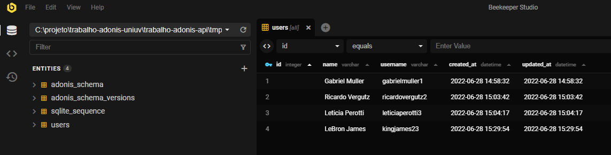
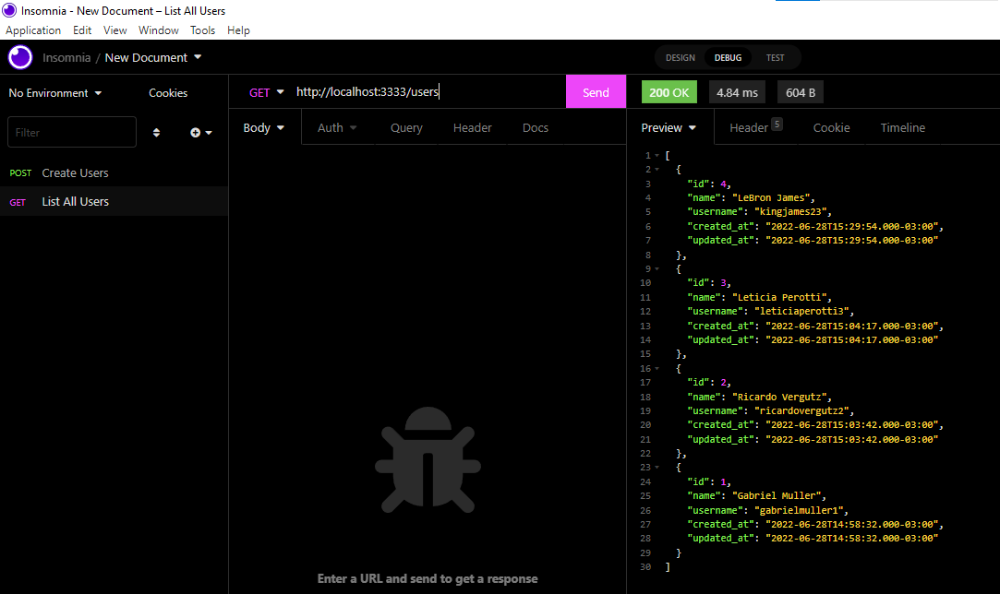
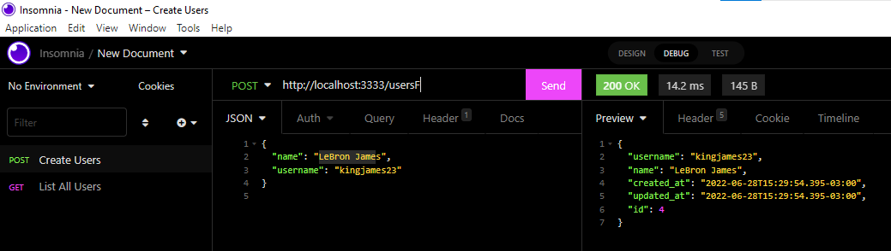

# Dependencias do Projeto

 -> Node: https://nodejs.org/en/download/ 

 -> Beekeeper: https://www.beekeeperstudio.io/ 

 -> Insomnia: https://insomnia.rest/download 

## Documentação do AdonisJS

 https://adonisjs.com/ 

---------------------------------------------------------------------------------------------------------------------------------

<strong> Feito por Gabriel Muller </strong>
